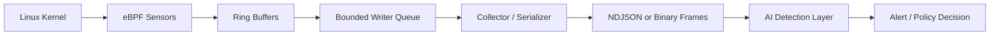
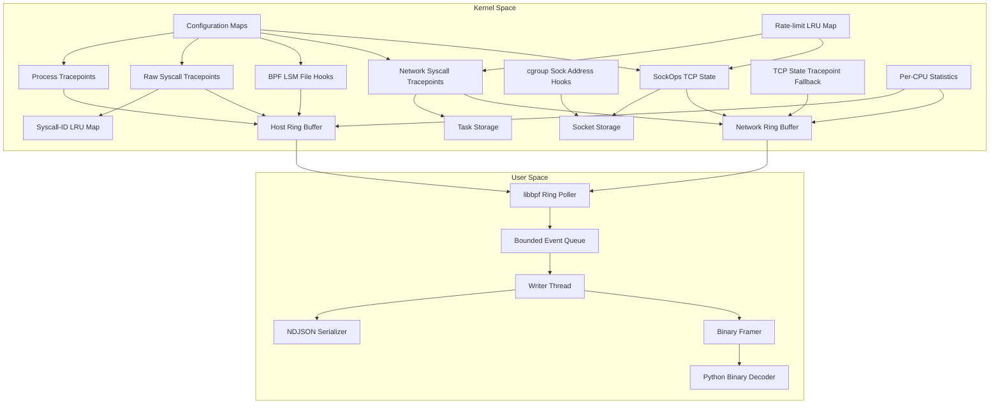
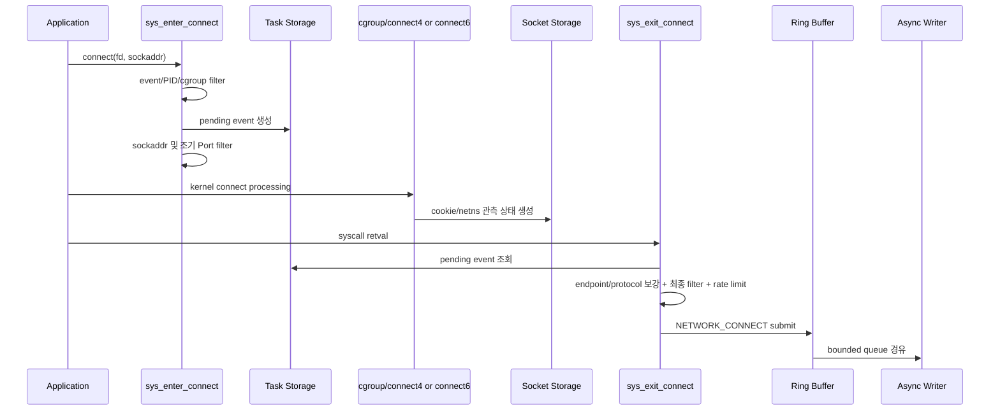
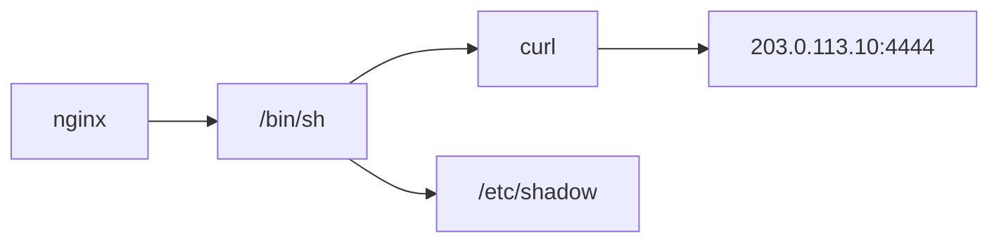

# eBPF 커널 이벤트 기반 AI 보안 에이전트

## eBPF 이벤트 수집 계층 설계·구현 보고서

> 작성일: 2026-09-09  
> 구현 상태: 핵심 센서, 최적화, 안정성 시험, 성능 측정, 커널 호환성 검증 완료  
> 대상 플랫폼: Linux x86-64, kernel 5.15 이상  
> 구현 언어: eBPF C + C/libbpf + Python 테스트 도구

---

## 목차

1. [프로젝트 개요](#1-프로젝트-개요)
2. [목표와 역할 경계](#2-목표와-역할-경계)
3. [구현 범위](#3-구현-범위)
4. [전체 아키텍처](#4-전체-아키텍처)
5. [기술 스택](#5-기술-스택)
6. [저장소 구조](#6-저장소-구조)
7. [공통 이벤트 ABI](#7-공통-이벤트-abi)
8. [프로세스·시스템콜 센서](#8-프로세스시스템콜-센서)
9. [파일 센서](#9-파일-센서)
10. [네트워크 센서](#10-네트워크-센서)
11. [eBPF Map 설계](#11-ebpf-map-설계)
12. [사용자 공간 Collector](#12-사용자-공간-collector)
13. [필터와 실행 옵션](#13-필터와-실행-옵션)
14. [최적화와 시간복잡도](#14-최적화와-시간복잡도)
15. [안정성·Backpressure·유실 관리](#15-안정성backpressure유실-관리)
16. [빌드와 실행](#16-빌드와-실행)
17. [테스트 전략과 결과](#17-테스트-전략과-결과)
18. [성능 측정](#18-성능-측정)
19. [커널 호환성](#19-커널-호환성)
20. [AI팀 연동 계약](#20-ai팀-연동-계약)
21. [보안·개인정보·권한](#21-보안개인정보권한)
22. [현재 제한사항](#22-현재-제한사항)
23. [운영 및 배포 권장사항](#23-운영-및-배포-권장사항)
24. [문제 해결](#24-문제-해결)
25. [향후 확장](#25-향후-확장)
26. [결론](#26-결론)

---

## 1. 프로젝트 개요

이 프로젝트는 Linux 커널에서 발생하는 보안 관련 행위를 eBPF로 관측하고,
사용자 공간 Collector를 거쳐 AI 탐지 시스템이 사용할 수 있는 구조화된 이벤트로
전달하는 보안 에이전트의 수집 계층이다.

eBPF 계층은 악성 여부를 직접 판단하지 않는다. 커널에서 확인할 수 있는 사실을
낮은 오버헤드로 수집하고, 이벤트의 출처와 유효성을 보존해 AI 계층으로 전달하는
것이 핵심 책임이다.

수집 대상은 다음과 같다.

- 프로세스 생성, 프로그램 실행, 프로세스 종료
- 선택한 프로세스 또는 cgroup의 시스템콜 진입·반환
- 파일 열기 및 삭제 보안 검사
- IPv4·IPv6 연결, bind, listen, accept
- 연결형·비연결형 UDP 전송
- TCP 상태 변화
- PID namespace, cgroup 및 network namespace 식별 정보
- 커널·사용자 공간에서 발생한 이벤트 유실 및 필터링 통계

이 구현은 단순한 `bpf_printk()` 데모가 아니라 다음 요소를 포함하는 독립 실행형
파이프라인이다.

```text
eBPF 센서 → Ring Buffer → Bounded Queue → Collector → NDJSON/Binary → AI 입력
```

---

## 2. 목표와 역할 경계

### 2.1 eBPF 계층의 책임

- 커널 hook에서 보안 이벤트 감지
- PID, UID, cgroup, 주소, Port, 반환값 등 원천 데이터 수집
- 고정 시간 필터 및 rate limit 적용
- 시스템콜 진입·종료와 socket 상태 연결
- Ring Buffer로 이벤트 전달
- 이벤트 유실 및 오류 통계 제공
- 커널 버전 차이에 대응하는 CO-RE 프로그램 제공
- AI 계층과 독립적으로 실행·검증 가능한 Collector 제공

### 2.2 AI 계층의 책임

- 서로 다른 이벤트의 장기 상관관계 분석
- 프로세스 트리 및 행위 그래프 구성
- 정상·이상 행위 분류
- 위험 점수 계산
- 공격 유형 분류
- 경보 또는 차단 정책 결정

### 2.3 역할 경계



현재 구현은 관측과 데이터 전달에 집중한다. 네트워크 cgroup 프로그램은 항상
허용을 반환하며, 파일 BPF LSM 프로그램도 기존 LSM 판정을 그대로 반환한다.
즉 이 버전은 접근이나 통신을 차단하지 않는다.

---

## 3. 구현 범위

### 3.1 포함된 기능

- libbpf skeleton 기반 load·attach·detach
- BTF + CO-RE 기반 커널 구조체 접근
- 프로세스 fork/exec/exit
- 선택적 raw syscall enter/exit
- BPF LSM 기반 file open/unlink
- connect/bind/listen/accept/accept4
- UDP sendto/sendmsg
- SockOps 및 tracepoint 기반 TCP state
- IPv4·IPv6와 IPv6 scope ID
- socket cookie, netns cookie, netns inode ID
- PID namespace 보정과 cgroup ID
- Task Storage와 Socket Storage
- cgroup sock-address hook과 fallback
- 이벤트별 선택적 autoload
- PID/cgroup/Port/protocol 필터
- O(1) rate limiter
- Ring Buffer 크기 설정
- 비동기 bounded writer queue
- NDJSON 및 binary frame 출력
- binary decoder
- 정적 loader 및 self-test 모드
- 성능·동시성·유실·backpressure 테스트
- 실제 5.15·6.1·6.6·6.8 커널 VM 호환성 검증

### 3.2 의도적으로 제외한 기능

- 패킷 payload 수집
- TLS 평문 분석
- 모든 DNS 도메인 복원
- 모든 시스템콜 인자의 상세 해석
- 네트워크 차단 및 파일 접근 차단
- XDP 기반 패킷 처리
- 장기 이벤트 저장소
- AI 모델 추론

payload 수집을 제외한 이유는 개인정보 노출, 저장량 증가, 암호화 트래픽의 낮은
효용, 커널 hot path 비용 때문이다. 현재 이벤트는 메타데이터 기반 행위 분석에
초점을 맞춘다.

---

## 4. 전체 아키텍처

### 4.1 커널과 사용자 공간 구성



### 4.2 프로세스 이벤트 흐름

```text
sched_process_* tracepoint
  → event mask/PID/cgroup 검사
  → 공통 헤더 및 프로세스 payload 작성
  → Ring Buffer reserve/submit
  → 사용자 공간 queue
  → NDJSON 또는 binary 출력
```

### 4.3 네트워크 connect 흐름



Task Storage는 진입·종료가 같은 task에서 실행되는 시스템콜 상태를 보관한다.
Socket Storage는 socket 수명에 귀속되는 cookie와 namespace 정보를 보관한다.

---

## 5. 기술 스택

| 영역 | 기술 |
|---|---|
| eBPF 프로그램 | C |
| 컴파일러 | clang/LLVM, `-target bpf` |
| 로더 | C + libbpf skeleton |
| 이식성 | BTF + BPF CO-RE |
| 커널→사용자 공간 | `BPF_MAP_TYPE_RINGBUF` |
| network syscall pending 상태 | `BPF_MAP_TYPE_TASK_STORAGE` |
| raw syscall ID 상관관계 | `BPF_MAP_TYPE_LRU_HASH` |
| socket 상태 | `BPF_MAP_TYPE_SK_STORAGE` |
| rate limit | `BPF_MAP_TYPE_LRU_HASH` + bounded CAS |
| 통계 | `BPF_MAP_TYPE_PERCPU_ARRAY` |
| 출력 | NDJSON, length-prefixed binary |
| Binary decoder | Python 3 |
| 호환성 검증 | 정적 loader + KVM/QEMU matrix |
| CI | GitHub Actions compatibility workflow |

주요 구현 파일은 다음과 같다.

- [`server.c`](server.c): 네트워크 eBPF 프로그램
- [`src/bpf/host_events.bpf.c`](src/bpf/host_events.bpf.c): 프로세스·syscall·파일 센서
- [`src/user/host_events.c`](src/user/host_events.c): loader, Collector, serializer
- [`include/agent_events.h`](include/agent_events.h): 공통 ABI
- [`tools/decode-events.py`](tools/decode-events.py): binary decoder
- [`Makefile`](Makefile): object, skeleton, 동적·정적 loader 빌드

---

## 6. 저장소 구조

```text
ebpf-agent/
├── PROJECT_REPORT.md
├── README.md
├── Makefile
├── server.c
├── include/
│   └── agent_events.h
├── src/
│   ├── bpf/
│   │   └── host_events.bpf.c
│   └── user/
│       └── host_events.c
├── tools/
│   └── decode-events.py
├── docs/
│   └── event-schema-v1.md
├── bench/
│   ├── udp-benchmark.py
│   ├── run-benchmark.sh
│   ├── profile-hooks.sh
│   └── latest-results.md
├── tests/
│   ├── runtime-smoke.sh
│   ├── network-smoke.sh
│   ├── binary-smoke.sh
│   ├── filter-smoke.sh
│   ├── rate-smoke.sh
│   ├── rate-map-smoke.sh
│   ├── backpressure-smoke.sh
│   ├── nonblocking-smoke.sh
│   ├── concurrency-smoke.sh
│   └── fallback-smoke.sh
├── compat/
│   ├── kernel-matrix.yaml
│   ├── run-local-matrix.sh
│   ├── latest-results.md
│   └── local-report.md
└── vm/
    └── profiles/
        ├── ubuntu-22.04-5.15.yaml
        ├── debian-12-6.1.yaml
        └── ubuntu-24.04-6.8.yaml
```

`.output/`, `.compat-tools/`, VM 이미지 캐시와 실행 중 생성되는 이벤트 파일은
`.gitignore`에서 제외한다.

---

## 7. 공통 이벤트 ABI

상세 정의는 [`docs/event-schema-v1.md`](docs/event-schema-v1.md)와
[`include/agent_events.h`](include/agent_events.h)를 기준으로 한다.

### 7.1 공통 헤더

| 필드 | 타입 | 의미 |
|---|---|---|
| `timestamp_ns` | `u64` | 커널 monotonic timestamp |
| `cgroup_id` | `u64` | 이벤트 task의 cgroup ID |
| `task_start_ns` | `u64` | PID 재사용 구분용 task 시작 시각 |
| `pid` | `u32` | 호스트 기준 thread ID |
| `tgid` | `u32` | 호스트 기준 process ID |
| `namespace_pid` | `u32` | 변환 가능한 namespace 기준 thread ID |
| `namespace_tgid` | `u32` | 변환 가능한 namespace 기준 process ID |
| `ppid` | `u32` | 호스트 기준 부모 TGID |
| `uid/gid` | `u32` | 호출 task의 사용자·그룹 ID |
| `cpu` | `u32` | 이벤트가 실행된 CPU |
| `result` | `s32` | 이벤트 결과 요약 |
| `size` | `u32` | 실제 record 길이 |
| `flags` | `u32` | 값 유효성·해석 플래그 |
| `version` | `u16` | schema version |
| `type` | `u16` | event type ID |
| `comm` | `char[16]` | 커널 task 이름 |

### 7.2 ABI 고정 크기

| 구조체 | 크기 |
|---|---:|
| Wire frame header | 12 bytes |
| Event common header | 88 bytes |
| Process payload | 272 bytes |
| Syscall payload | 16 bytes |
| File payload | 288 bytes |
| Network payload | 112 bytes |
| Health payload | 40 bytes |
| 전체 고정 event | 376 bytes |
| 네트워크 가변 record | 200 bytes |
| Health record | 128 bytes |

Collector 빌드 시 `_Static_assert`로 크기를 검증한다. 구조체 크기나 기존 필드
offset이 바뀌면 빌드가 실패한다. 호환되지 않는 변경은 schema version을 증가시키고
별도 decoder를 제공해야 한다.

### 7.3 이벤트 타입

| ID | 이름 | 기본 활성화 |
|---:|---|:---:|
| 1 | `PROCESS_FORK` | O |
| 2 | `PROCESS_EXEC` | O |
| 3 | `PROCESS_EXIT` | O |
| 4 | `SYSCALL_ENTER` | X |
| 5 | `SYSCALL_EXIT` | X |
| 6 | `FILE_OPEN` | 환경 의존 |
| 7 | `FILE_UNLINK` | 환경 의존 |
| 8 | `NETWORK_CONNECT` | O |
| 9 | `NETWORK_BIND` | O |
| 10 | `NETWORK_LISTEN` | O |
| 11 | `NETWORK_ACCEPT` | O |
| 12 | `NETWORK_UDP_SEND` | O |
| 13 | `NETWORK_TCP_STATE` | X |
| 14 | `HEALTH` | O |

syscall 이벤트와 TCP state는 고빈도 이벤트이므로 기본 비활성화한다. `HEALTH`는
Collector가 1초마다 생성하며 유실·필터·rate-limit 누계를 전달한다.

### 7.4 이벤트 플래그

| 플래그 | 의미 |
|---|---|
| `PATH_UNAVAILABLE` | 경로를 읽을 수 없음 |
| `PATH_TRUNCATED` | 경로가 버퍼 크기를 초과함 |
| `PARTIAL_PATH` | 전체 경로가 아닌 basename 등 일부만 존재 |
| `MISSING_ENTRY` | enter/exit 상관 상태가 없음 |
| `NETWORK_DEST_VALID` | destination address가 유효함 |
| `NETWORK_SOURCE_VALID` | source address가 유효함 |
| `NETWORK_SOCKET_VALID` | socket metadata가 유효함 |
| `NETWORK_COOKIE_VALID` | socket cookie가 유효함 |
| `NETWORK_NETNS_COOKIE_VALID` | netns cookie가 유효함 |
| `NETWORK_PROCESS_UNCERTAIN` | 현재 PID가 실제 socket 소유자라고 보장할 수 없음 |

주소값이 0인 경우와 주소를 수집하지 못한 경우를 flags로 구분한다. AI Consumer는
값만 확인하지 말고 validity flag를 반드시 함께 확인해야 한다.

---

## 8. 프로세스·시스템콜 센서

구현 파일: [`src/bpf/host_events.bpf.c`](src/bpf/host_events.bpf.c)

### 8.1 Process fork

- Hook: `tp/sched/sched_process_fork`
- 부모 PID와 생성된 child PID 수집
- 공통 헤더에 UID, cgroup, namespace, task 시작 시각 포함
- thread 생성과 process 생성이 모두 발생할 수 있으므로 AI 계층에서 TGID를 기준으로
  구분해야 한다.

### 8.2 Process exec

- Hook: `tp/sched/sched_process_exec`
- 성공한 프로그램 실행만 관측
- 실행 filename, PID, PPID, UID, comm 수집
- tracepoint data location을 이용해 filename을 안전하게 복사
- 경로를 읽지 못하거나 잘린 경우 플래그 설정

### 8.3 Process exit

- Hook: `tp/sched/sched_process_exit`
- `pid == tgid` 조건으로 process leader 종료만 전송
- 모든 thread exit를 전송하지 않아 이벤트 폭증 방지
- raw exit code 보존

### 8.4 선택적 syscall sequence

- Hook: `raw_tracepoint/sys_enter`, `raw_tracepoint/sys_exit`
- syscall ID, enter/exit, 반환값 수집
- `--syscalls`를 명시해야 로드
- `--target-pid` 또는 `--target-cgroup` 없이는 활성화 불가
- exit tracepoint에 syscall ID가 없으므로 enter 시 상태를 저장해 연결
- syscall별 인자 전체는 해석하지 않음

시스템 전체 syscall을 항상 수집하면 이벤트량과 AI 입력 잡음이 크게 증가한다.
따라서 평상시에는 의미가 정규화된 process/file/network 이벤트를 사용하고,
의심 프로세스의 상세 분석에만 syscall sequence를 활성화한다.

---

## 9. 파일 센서

구현 파일: [`src/bpf/host_events.bpf.c`](src/bpf/host_events.bpf.c)

### 9.1 File open

- Hook: `lsm.s/file_open`
- file path, inode, device, open flags, mode 수집
- `bpf_d_path()`를 사용하기 위해 sleepable BPF LSM 사용
- 기존 LSM 반환값을 보존하므로 접근 정책을 변경하지 않음
- 이 이벤트는 최종 `open()` 성공이 아니라 LSM 검사 시점의 접근 시도

### 9.2 File unlink

- Hook: `lsm/inode_unlink`
- 삭제 대상 inode, parent directory inode, device, dentry 이름 수집
- 이 hook에서는 전체 경로를 안정적으로 재구성하지 않으므로 basename만 전송
- `PARTIAL_PATH` 플래그로 Consumer에 의미 전달
- 기존 LSM 반환값을 그대로 반환

### 9.3 BPF LSM fallback

Loader는 `/sys/kernel/security/lsm`에서 BPF LSM 활성 여부를 확인한다. 사용할 수 없는
환경에서는 파일 센서를 비활성화하고 나머지 센서는 계속 실행한다.

```bash
sudo .output/host-events --no-file
```

---

## 10. 네트워크 센서

구현 파일: [`server.c`](server.c)

### 10.1 공통 네트워크 필드

| 필드 | 의미 |
|---|---|
| `family` | `AF_INET(2)` 또는 `AF_INET6(10)` |
| `protocol` | TCP 6, UDP 17 등 IP protocol 번호 |
| `socket_type` | STREAM, DGRAM 등 socket type |
| `sockfd` | syscall에서 사용한 file descriptor |
| `netns_id` | network namespace inode ID |
| `netns_cookie` | 지원 hook에서 얻은 namespace cookie |
| `socket_cookie` | socket 수명 동안 사용할 상관 식별자 |
| `src_ip/src_port` | 로컬 또는 이벤트 의미상 source endpoint |
| `dst_ip/dst_port` | 원격 또는 이벤트 의미상 destination endpoint |
| `retval` | 원래 signed syscall 반환값 |
| `duration_ns` | syscall enter에서 exit까지의 시간 |
| `bytes_requested` | sendto에서 요청한 byte 수 |
| `backlog` | listen backlog |
| `old_state/new_state` | TCP 상태 전이 |
| `src_scope_id/dst_scope_id` | IPv6 scope ID |

IP 주소는 network byte order의 바이트 배열, Port는 host byte order로 ABI에 저장한다.
NDJSON Serializer와 Python decoder가 사람이 읽을 수 있는 IP 문자열로 변환한다.

### 10.2 Connect

- Hook: `sys_enter_connect`, `sys_exit_connect`
- IPv4·IPv6 destination 주소와 Port
- 연결 후 source 주소와 자동 할당 Port
- protocol, socket type, netns, socket cookie
- 실제 syscall retval
- 비차단 socket의 `-EINPROGRESS(-115)` 보존

`-EINPROGRESS`는 비동기 연결이 진행 중이라는 의미이므로 즉시 실패로 분류하면 안 된다.

### 10.3 Bind

- Hook: `sys_enter_bind`, `sys_exit_bind`
- 요청 local 주소·Port와 실제 bind 결과
- Port 0을 사용한 자동 할당 Port도 exit에서 보강
- TCP·UDP 구분 가능

### 10.4 Listen

- Hook: `sys_enter_listen`, `sys_exit_listen`
- listening socket의 local endpoint
- protocol 및 socket type
- backlog와 retval
- AF_UNIX 등 지원 범위 밖의 socket은 전송하지 않음

### 10.5 Accept

- Hook: `sys_enter_accept/accept4`, `sys_exit_accept/accept4`
- 성공한 accept만 전송해 nonblocking `EAGAIN` 반복 잡음 제거
- source는 원격 client, destination은 로컬 server로 정규화
- accepted fd, 주소, Port, protocol 포함

### 10.6 UDP sendto/sendmsg

- Hook: `sys_enter_sendto/sendmsg`, `sys_exit_sendto/sendmsg`
- 비연결형 UDP destination 수집
- 연결형 UDP는 socket peer 정보로 보강
- `retval`을 실제 전송 byte 수로 사용
- `sendmsg` iovec 전체 순회는 하지 않아 입력 크기에 따른 커널 비용 제거
- `sendto`는 `bytes_requested`를 기록하고 `sendmsg`는 0일 수 있음

### 10.7 TCP state

기본 경로는 cgroup SockOps와 Socket Storage이다.

- active/passive established에서 Socket Storage 생성
- socket cookie와 netns cookie 보존
- state callback flag 활성화
- 이후 상태 전이를 cookie 기준으로 전송
- socket 종료 시 storage 자동 정리

SockOps가 없는 환경에서는 `sock/inet_sock_set_state` tracepoint를 fallback으로 사용한다.
5.15·6.1·6.8에서 SockOps가 허용하지 않는 current task/cgroup helper가 있으므로
SockOps 전용 최소 헤더는 해당 helper를 호출하지 않는다.

TCP state callback은 항상 socket 소유 프로세스 문맥에서 실행되는 것이 아니다.
따라서 PID보다 `socket_cookie`로 connect 이벤트와 연결해야 한다.

TCP state는 이벤트량이 많기 때문에 기본 비활성화된다.

```bash
sudo .output/host-events --network-events connect,tcp-state
```

### 10.8 cgroup 보강 hook

- `cgroup/connect4`, `cgroup/connect6`
- `cgroup/bind4`, `cgroup/bind6`
- `cgroup/sendmsg4`, `cgroup/sendmsg6`
- `sockops`

기본 attach 경로는 `/sys/fs/cgroup`이다. 각 프로그램은 항상 `1`을 반환해 원래
네트워크 동작을 허용한다.

```bash
sudo .output/host-events --cgroup-path /sys/fs/cgroup/my-service
```

지원하지 않는 환경에서는 다음 옵션으로 syscall tracepoint만 사용한다.

```bash
sudo .output/host-events --no-cgroup-hooks
```

---

## 11. eBPF Map 설계

### 11.1 Host Ring Buffer

- 타입: `BPF_MAP_TYPE_RINGBUF`
- 프로세스·syscall·파일 이벤트 전달
- 기본 크기: 16 MiB
- 공간 부족 시 이벤트를 기다리지 않고 lost counter 증가

### 11.2 Network Ring Buffer

- 타입: `BPF_MAP_TYPE_RINGBUF`
- 네트워크 이벤트 전달
- 기본 크기: 4 MiB
- 네트워크 record를 200바이트만 전송해 전체 376바이트 전송 대비 약 47% 절감

두 Ring Buffer 크기는 실행 전에 변경할 수 있다.

```bash
sudo .output/host-events --ringbuf-bytes 8388608
```

값은 4096~64 MiB 범위의 2의 거듭제곱이어야 한다.

### 11.3 Task Storage

- 타입: `BPF_MAP_TYPE_TASK_STORAGE`
- network syscall enter/exit pending 상태 저장
- LRU Hash key 계산과 고정 최대 엔트리 사전 할당 제거
- 동일 task에서 enter/exit 연결
- task 종료 시 자동 정리
- 현재 pending 값 크기: 224 bytes

### 11.4 Socket Storage

- 타입: `BPF_MAP_TYPE_SK_STORAGE`
- socket cookie, netns cookie, cgroup 정보를 socket에 귀속
- SockOps TCP 상태 추적에 사용
- socket 종료 시 자동 정리
- 값 크기: 24 bytes

### 11.5 Rate-limit Map

- 타입: `BPF_MAP_TYPE_LRU_HASH`
- Key: `(cgroup_id, tgid, event_type, protocol, relevant_port)`
- Value: 다음 허용 시각 8바이트
- 기본 최대 엔트리: 8192
- LRU 포화 시 오래 사용되지 않은 bucket 자동 제거

```bash
sudo .output/host-events --rate-map-entries 16384
```

### 11.6 Configuration Map

Loader가 다음 설정을 커널에 전달한다.

- event bit mask
- target cgroup ID
- PID namespace device/inode
- target TGID와 Collector 제외 TGID
- network destination Port
- protocol
- SockOps 상태 사용 여부
- rate interval 및 burst allowance

### 11.7 Per-CPU Statistics

고빈도 counter는 CPU별 값을 사용해 공유 cache line 경쟁을 피한다. Per-CPU Map에서는
atomic 연산이 필요하지 않으므로 일반 증가 연산을 사용한다. 사용자 공간에서 종료 시
모든 CPU 값을 합산한다.

---

## 12. 사용자 공간 Collector

구현 파일: [`src/user/host_events.c`](src/user/host_events.c)

### 12.1 주요 책임

- BPF skeleton open/load/attach/destroy
- cgroup 프로그램 수동 attach
- kernel 기능이 없는 경우 fallback 선택
- 설정 Map 초기화
- 두 Ring Buffer polling
- event version·size 검증
- bounded queue에 raw event 복사
- 별도 writer thread에서 직렬화
- NDJSON 또는 binary frame 출력
- 주기적 `HEALTH` 이벤트와 종료 시 유실·필터·rate-limit 통계 출력
- 안전한 append 출력, symlink 거부 및 regular file `0600` 강제
- load/attach 완료 후 UID/GID `65534:65534`로 기본 권한 강등
- signal 기반 정상 종료

### 12.2 Bounded writer queue

Ring Buffer callback에서 JSON 변환이나 파일 쓰기를 직접 수행하면 느린 디스크 또는
AI 입력 sink가 커널 polling을 지연시킨다. 이를 피하기 위해 producer 한 개와 writer
한 개로 구성된 bounded queue를 사용한다.

```text
Ring Buffer callback
  → 크기 검사
  → 고정 크기 메모리 복사 O(1)
  → queue push O(1)
  → 즉시 polling 복귀

Writer thread
  → queue pop O(1)
  → NDJSON/Binary 직렬화
  → stdio 1 MiB buffer
  → batch flush
```

기본 queue capacity는 4096이다.

```bash
sudo .output/host-events --queue-capacity 16384
```

Queue 용량의 1/8은 exec, unlink, 주요 네트워크 이벤트와 `HEALTH`에 예약한다. 일반
이벤트는 예약 구간을 침범하기 전에 drop하며, 고우선순위 이벤트는 전체 Queue가 찬
경우에만 drop한다. 누계는 `HEALTH`와 `writer queue dropped`로 전달한다.

### 12.3 NDJSON 출력

- 디버깅과 사람이 직접 확인하기 쉬움
- 이벤트당 한 줄
- 문자열 JSON escaping 적용
- 유효한 UTF-8은 보존하고 잘못된 바이트는 `\u00xx`로 byte-safe escaping
- IP 주소를 표준 문자열로 변환
- 고부하에서는 binary보다 CPU 사용량이 큼

### 12.4 Binary 출력

Binary frame은 다음 구조를 사용한다.

```text
4 bytes  magic "EBPF"
1 byte   wire version
1 byte   little-endian marker
2 bytes  reserved
4 bytes  payload length
N bytes  agent_event record
```

```bash
sudo .output/host-events --format binary --output events.bin
python3 tools/decode-events.py events.bin > events.ndjson
```

프레임은 추가 동적 할당 없이 고정 크기 stack buffer에 작성한다. AI팀이 C ABI를
직접 처리하기 어려운 경우 제공된 decoder를 기준 구현으로 사용할 수 있다.

---

## 13. 필터와 실행 옵션

### 13.1 전체 옵션

| 옵션 | 설명 |
|---|---|
| `--syscalls` | 고용량 syscall enter/exit 활성화 |
| `--no-file` | BPF LSM 파일 센서 비활성화 |
| `--target-pid PID` | 해당 TGID만 수집 |
| `--target-cgroup ID` | 정확히 같은 cgroup ID만 수집 |
| `--network-port PORT` | 이벤트 의미상 관련 Port 필터 |
| `--network-protocol P` | `tcp`, `udp` 또는 protocol 번호 필터 |
| `--network-events LIST` | 필요한 네트워크 hook만 autoload |
| `--network-rate N` | cgroup·TGID·이벤트·protocol·Port별 초당 허용률 |
| `--network-burst N` | rate-limit burst 크기 |
| `--ringbuf-bytes N` | 각 Ring Buffer 크기 |
| `--cgroup-path PATH` | cgroup hook attach 경로 |
| `--no-cgroup-hooks` | cgroup 보강을 끄고 tracepoint fallback 사용 |
| `--format FORMAT` | `ndjson` 또는 `binary` |
| `--queue-capacity N` | writer queue slot 수 |
| `--rate-map-entries N` | rate-limit LRU capacity |
| `--self-test` | 짧게 load/attach/poll 후 종료 |
| `--output PATH` | 출력 경로 |
| `--run-as UID:GID` | BPF 설정 후 실행 권한 강등 대상 |
| `--retain-privileges` | 명시적으로 root 권한 유지 |
| `--allow-special-output` | 신뢰된 FIFO/character device 출력 허용 |

### 13.2 선택적 autoload

`event_mask`로 실행 중 이벤트를 버리는 것만으로는 hook 호출 비용이 남는다. 따라서
사용하지 않는 프로그램은 load 전에 `bpf_program__set_autoload(false)`로 제거한다.

지원 목록:

```text
connect,bind,listen,accept,udp,tcp-state,all,none
```

```bash
sudo .output/host-events --network-events connect,accept
```

이 경우 bind/listen/UDP/TCP-state BPF 프로그램은 커널에 로드되지 않는다.

### 13.3 필터 적용 순서

비용이 낮은 검사를 가능한 앞에 배치한다.

```text
autoload 여부
→ event mask
→ PID namespace / target TGID
→ cgroup ID
→ 고정 길이 sockaddr 읽기
→ Port 필터
→ syscall 실행
→ socket metadata 및 protocol 확인
→ 최종 Port/protocol 필터
→ rate limit
→ Ring Buffer 제출
```

connect syscall 인자에는 protocol이 없으므로 protocol 필터는 socket metadata를 얻은
exit 단계에서 적용한다.

---

## 14. 최적화와 시간복잡도

### 14.1 설계 목표

커널 hot path에서 데이터 크기 또는 전체 Map 크기에 비례하는 처리를 하지 않는다.
모든 반복문은 컴파일 타임 상한이 있고 verifier가 완전히 확인할 수 있다.

### 14.2 이벤트당 복잡도

| 연산 | 시간복잡도 | 비고 |
|---|---|---|
| Array 설정 Map 조회 | O(1) | key 0 하나 |
| Task Storage 조회 | O(1) | task 귀속 상태 |
| Socket Storage 조회 | O(1) | socket 귀속 상태 |
| Rate LRU 조회 | 평균 O(1) | cgroup + TGID + event + protocol + Port key |
| Rate CAS | O(1) | 최대 4회로 제한 |
| IPv4/IPv6 처리 | O(1) | 4/16바이트 고정 |
| FD array 접근 | O(1) | index 직접 접근 |
| Ring Buffer reserve/submit | O(1) | 공간 부족 시 즉시 실패 |
| Queue push/pop | O(1) | bounded circular queue |
| 전체 파이프라인 | O(E) | E는 필터 통과 이벤트 수 |

모든 입력 이벤트를 관측해야 하므로 전체 비용 하한은 `Ω(E)`이다. 따라서 가장 큰
최적화는 한 이벤트를 O(1)보다 낮게 만드는 것이 아니라, 불필요한 hook을 로드하지
않고 이벤트 수 E 자체를 줄이는 것이다.

### 14.3 적용한 최적화

1. **선택적 autoload**: 비활성 hook의 실행 비용을 0으로 만듦
2. **조기 필터**: 상세 커널 구조체 접근 전 PID/cgroup/Port 검사
3. **Task Storage**: 10,240-entry pending LRU를 task-local 상태로 교체
4. **Socket Storage**: socket 상태를 socket 수명에 귀속
5. **가변 길이 record**: 네트워크 이벤트를 376→200바이트로 감소
6. **Per-CPU counter**: CPU 간 atomic 경쟁 제거
7. **bounded CAS rate limiter**: 무한 retry 없이 최대 4회
8. **iovec 순회 제거**: sendmsg 입력 개수와 무관한 고정 시간 처리
9. **TCP state 기본 비활성화**: 고빈도 global 이벤트 차단
10. **비동기 writer queue**: 커널 poller와 직렬화·I/O 분리
11. **Binary frame**: JSON 변환 비용을 선택적으로 제거
12. **Batch flush**: 이벤트마다 `fflush()`를 호출하지 않음

### 14.4 Rate limiter

rate limiter는 GCRA/token-bucket과 같은 형태로 다음 허용 시각을 관리한다.

- Key: cgroup ID + TGID + event type + protocol + 관련 Port
- 필터와 socket metadata 확인을 통과한 이벤트만 quota 소비
- 사용자 공간에서 rate를 nanosecond interval로 변환
- Kernel에서는 나눗셈 없이 비교·덧셈만 수행
- 64-bit CAS 최대 4회
- 경쟁이 지속되면 안전하게 이벤트를 제한
- Rate Map 포화 시 LRU eviction

```bash
sudo .output/host-events --network-rate 1000 --network-burst 2000
```

---

## 15. 안정성·Backpressure·유실 관리

### 15.1 유실 계층

이벤트는 다음 지점에서 유실될 수 있다.

| 계층 | 원인 | 통계 |
|---|---|---|
| Kernel Ring Buffer | Consumer 지연, 공간 부족 | `ringbuf_lost` 또는 event별 lost |
| Pending state | Task Storage 생성 실패 | `map_update_failed` |
| Socket metadata | FD race·지원하지 않는 socket | `socket_read_failed` |
| User address | 잘못된 포인터·짧은 sockaddr | `user_read_failed` |
| Filter | Port/protocol 불일치 | `filtered` |
| Rate limit | token 부족 | `rate_limited` |
| Writer queue | 출력 sink 지연 | `writer queue dropped` |

AI Consumer는 이벤트가 없다는 사실과 수집 과정에서 유실됐다는 사실을 구분해야 한다.

### 15.2 Backpressure 정책

사용자 공간 queue는 bounded이다. 저우선순위 이벤트가 먼저 제한되고 1/8 예약 영역을
중요 이벤트와 `HEALTH`가 사용한다. 전체 queue가 찬 경우에는 중요 이벤트도 drop할 수
있지만, 누계가 주기적 `HEALTH` 이벤트에 포함된다.

이 정책은 다음을 보장한다.

- 출력 장애로 인한 무제한 메모리 증가 방지
- 보안 에이전트가 대상 서버를 멈추는 상황 방지
- drop 수의 명시적 관측
- sink 복구 후 정상 처리 재개

느린 FIFO reader와 queue capacity 8을 사용한 테스트에서 drop이 의도대로 발생하고,
프로그램이 정상 종료하며 kernel Ring Buffer는 별도로 집계되는 것을 확인했다.

### 15.3 Fail-open 원칙

현재 버전은 관측 에이전트이므로 센서 내부 오류가 애플리케이션 동작을 막아서는 안
된다. cgroup hook은 `1`, BPF LSM은 기존 반환값을 반환한다. Map 또는 Ring Buffer가
가득 차면 이벤트만 누락하고 원래 syscall은 계속 실행된다.

---

## 16. 빌드와 실행

### 16.1 요구사항

- Linux x86-64
- `/sys/kernel/btf/vmlinux`
- clang/LLVM
- bpftool
- libbpf, libelf, zlib 개발 패키지
- make, gcc
- Python 3: decoder와 테스트
- 파일 센서 사용 시 BPF LSM
- cgroup 보강 사용 시 cgroup v2 권장

Ubuntu/Debian 예시:

```bash
sudo apt-get update
sudo apt-get install -y clang llvm gcc make pkg-config \
  libbpf-dev libelf-dev zlib1g-dev linux-tools-common linux-tools-generic
```

### 16.2 동적 빌드

```bash
cd ebpf-agent
make
```

생성 결과:

```text
.output/vmlinux.h
.output/host_events.bpf.o
.output/host_events.skel.h
.output/server.bpf.o
.output/server.skel.h
.output/host-events
```

### 16.3 정적 빌드

```bash
make static
```

생성되는 `.output/host-events-static`은 VM 호환성 테스트에 사용한다.

### 16.4 기본 실행

```bash
sudo .output/host-events
sudo .output/host-events --no-file --output events.ndjson
```

### 16.5 선택적 syscall 추적

```bash
sudo .output/host-events --no-file --syscalls \
  --target-pid 4210 --output syscall-events.ndjson
```

### 16.6 네트워크 필터

```bash
sudo .output/host-events --no-file \
  --network-events connect,accept \
  --network-protocol tcp \
  --network-port 443 \
  --network-rate 1000 \
  --network-burst 2000 \
  --output network-events.ndjson
```

### 16.7 Binary 모드

```bash
sudo .output/host-events --no-file --format binary --output events.bin
python3 tools/decode-events.py events.bin > events.ndjson
python3 tools/decode-events.py events.bin --count
```

### 16.8 현재 커널 self-test

```bash
sudo .output/host-events-static --self-test --no-file \
  --network-events all --format binary --output /tmp/self-test.bin
```

---

## 17. 테스트 전략과 결과

이번 전체 검증의 상세 명령·환경·판정은
[`VALIDATION_REPORT.md`](VALIDATION_REPORT.md)에 기록했다.

### 17.1 테스트 목록

| 테스트 | 검증 내용 |
|---|---|
| `runtime-smoke.sh` | process + 선택 PID syscall 기본 흐름 |
| `network-smoke.sh` | IPv4/IPv6, bind/listen/connect/accept/UDP/TCP state |
| `binary-smoke.sh` | Binary frame encode/decode 후 동일 schema 검증 |
| `filter-smoke.sh` | event autoload + protocol + Port 필터 |
| `rate-smoke.sh` | 100-event burst rate limit |
| `rate-map-smoke.sh` | capacity 2 LRU 포화 동작 |
| `backpressure-smoke.sh` | 느린 sink와 bounded queue drop |
| `nonblocking-smoke.sh` | `-EINPROGRESS` 보존 |
| `concurrency-smoke.sh` | 멀티스레드 400 connect/accept 쌍 |
| `fallback-smoke.sh` | cgroup/SockOps 없는 tracepoint 경로 |
| `lsm-qemu-init` | BPF LSM 활성 커널의 file open/unlink end-to-end |
| `security-smoke.sh` | symlink, 권한, UTF-8, oversized/truncated frame 공격 회귀 |

### 17.2 실행

```bash
sudo bash tests/runtime-smoke.sh
sudo bash tests/network-smoke.sh
sudo bash tests/binary-smoke.sh
sudo bash tests/filter-smoke.sh
sudo bash tests/rate-smoke.sh
sudo bash tests/rate-map-smoke.sh
sudo bash tests/backpressure-smoke.sh
sudo bash tests/nonblocking-smoke.sh
sudo bash tests/concurrency-smoke.sh
sudo bash tests/fallback-smoke.sh
sudo bash tests/security-smoke.sh
```

### 17.3 주요 결과

- IPv4·IPv6 TCP round trip 이벤트 검증 통과
- bind/listen/connect/accept endpoint 관계 검증 통과
- UDP sendto/sendmsg 검증 통과
- socket cookie로 connect와 TCP state 연결 확인
- Binary decoder 출력이 NDJSON 검증기 통과
- 비차단 connect의 kernel retval `-115` 확인
- UDP 100건 burst에서 2건 전송, 98건 제한
- Rate Map capacity 2에서 LRU 포화 후에도 Map update 실패 0
- 8개 thread가 만든 connect 400건 + accept 400건 전부 수집
- 동시성 시험에서 writer queue drop 0
- 동시성 시험에서 Ring Buffer loss 0
- cgroup hook 없는 fallback 검증 통과
- 다른 PID namespace에서 발생한 이벤트가 누락되지 않음
- Linux 6.6.145 BPF LSM 환경에서 file open 4건, unlink 1건 수집·검증 통과

### 17.4 Backpressure 결과

테스트 조건:

- UDP 이벤트 10,000건
- writer queue capacity 8
- FIFO reader가 2.5초 동안 읽지 않음

관찰 결과 예:

```text
writer queue dropped=9699
writer priority dropped=1
NETWORK_UDP_SEND received=303
ringbuf_lost=0
HEALTH writer_queue_dropped > 0
```

이는 느린 sink에서도 메모리가 무한 증가하지 않고, drop 위치가 명확하게 관측됨을
보여준다.

### 17.5 파일 BPF LSM 실부팅 결과

Linux 6.6.145 커널을 `CONFIG_BPF_LSM=y`, `CONFIG_DEBUG_INFO_BTF=y`,
`CONFIG_FUNCTION_TRACER=y`, `CONFIG_DYNAMIC_FTRACE=y`로 빌드하고 QEMU에서
`lsm=bpf`로 실제 부팅했다. [`tests/lsm-qemu-init`](tests/lsm-qemu-init)이 파일 열기와
삭제 workload를 실행한 결과는 다음과 같다.

```text
active LSMs: capability,bpf
FILE_OPEN        received=4 lost=0
FILE_UNLINK      received=1 lost=0
HEALTH           received=3 lost=0
EBPF_LSM_FILE_TEST_PASS
```

이 결과는 두 파일 프로그램의 verifier load와 attach뿐 아니라 Ring Buffer, Collector,
NDJSON 직렬화, UID/GID 65534 권한 강등 및 최종 이벤트 assertion까지 포함한다.

---

## 18. 성능 측정

상세 결과: [`bench/latest-results.md`](bench/latest-results.md)

### 18.1 기준 환경

- Ubuntu 24.04 WSL2
- kernel `6.18.33.1-microsoft-standard-WSL2`
- binary 출력
- PID 대상 필터
- UDP sendto workload

### 18.2 처리량 결과

| 항목 | 결과 |
|---|---:|
| 생성한 UDP syscall | 10,000 |
| workload 시간 | 155,733,575 ns |
| workload 처리율 | 64,212 events/s |
| 수집된 UDP 이벤트 | 10,000 |
| Capture ratio | 1.000000 |
| Writer queue drop | 0 |
| Kernel Ring Buffer loss | 0 |
| Collector user CPU | 0.03 s |
| Collector system CPU | 0.10 s |
| 최대 RSS | 39,928 KiB |

### 18.3 Kernel hook 실행시간

`kernel.bpf_stats_enabled=1`을 측정 중에만 활성화하고 종료 후 원래 값으로 복원했다.

| 항목 | 결과 |
|---|---:|
| 대상 프로그램 | `trace_sendto_enter` |
| 호출 수 | 10,004 |
| 누적 실행시간 | 14,937,005 ns |
| 평균 실행시간 | 1,493.10 ns/call |

Ubuntu 패키지 bpftool은 hardware instruction/cycle profile 없이 빌드되어 kernel
software runtime stats를 사용했다.

### 18.4 재측정

```bash
sudo bash bench/run-benchmark.sh .output/host-events 50000
sudo bash bench/profile-hooks.sh .output/host-events 100000
```

이 수치는 WSL 기준 회귀 baseline이다. 실제 배포 서버에서는 예상 workload와 동일한
cgroup, CPU 수, 저장 장치, Collector sink를 사용해 다시 측정해야 한다.

---

## 19. 커널 호환성

상세 결과:

- [`compat/latest-results.md`](compat/latest-results.md)
- [`compat/local-report.md`](compat/local-report.md)
- [`compat/kernel-matrix.yaml`](compat/kernel-matrix.yaml)

### 19.1 검증 방식

1. BPF object를 포함한 정적 loader 빌드
2. 각 배포판 cloud image를 disposable KVM VM으로 부팅
3. VM 내부에서 실제 root 권한으로 loader 실행
4. libbpf CO-RE relocation, Map 생성, verifier load, attach 수행
5. self-test exit code로 결과 판정

검증 명령:

```bash
host-events-static --self-test --no-file --network-events all \
  --format binary --output /tmp/ebpf-agent-self-test.bin
```

일반 배포판 매트릭스는 커널별 BPF LSM 활성 상태 차이를 배제하기 위해 `--no-file`로
수행했다. 파일 센서는 BPF LSM을 명시적으로 활성화한 Linux 6.6.145 QEMU에서 별도
end-to-end 시험했다.

### 19.2 결과

| 프로필 | 실제 부팅 커널 | 결과 |
|---|---|---|
| Ubuntu 22.04 | `5.15.0-190-generic` | PASS |
| Debian 12 | `6.1.0-52-cloud-amd64` | PASS |
| Custom BPF LSM QEMU | `6.6.145` | PASS |
| Ubuntu 24.04 | `6.8.0-138-generic` | PASS |

보안 수정이 반영된 최종 정적 loader로 2026-09-09에 매트릭스를 다시 실행했으며 세
대상 모두 command-mode self-test가 PASS였다.

### 19.3 호환성 문제와 해결

초기 VM 실행에서는 세 커널 모두 SockOps 프로그램 load가 실패했다.

- 5.15·6.1: SockOps에서 `bpf_get_current_cgroup_id` 미지원
- 6.8: SockOps에서 `bpf_get_current_pid_tgid` 미지원

SockOps 상태 callback은 본래 socket 소유 task 문맥을 보장하지 않으므로, task 관련
helper를 제거하고 timestamp·schema·socket 정보만 채우는 전용 헤더 경로로 변경했다.
수정 후 동일 세 커널에서 모두 통과했다.

### 19.4 자동화

저장소 루트의 [`.github/workflows/ebpf-compatibility.yml`](../.github/workflows/ebpf-compatibility.yml)은
다음 작업을 수행한다.

- 빌드 의존성 설치
- 정적 loader 생성
- 5.15·6.1·6.8 VM 매트릭스 실행
- 실제 loader command 결과로 호환성 판정

호환성 도구 action은 tag가 아닌 고정 commit SHA로 pin했다.

---

## 20. AI팀 연동 계약

### 20.1 권장 연동 방식

개발·디버깅 단계:

```text
NDJSON file or stdout
```

고부하·운영 단계:

```text
Binary frame → decoder/adapter → Protobuf or message queue → AI service
```

### 20.2 AI팀 전달 패키지

```bash
make static
bash tools/build-ai-handoff.sh
```

`dist/ai-handoff-schema-v1-20260909.tar.gz`와 zip에는 정적 Collector, C ABI,
machine-readable JSON Schema, 공식 decoder, 14개 이벤트 타입을 모두 포함하는 19개
sanitized fixture, 별도 ground-truth manifest, 검증 보고서와 체크섬이 들어 있다.
압축본은 다시 해제한 뒤 bundle validator와 binary→NDJSON byte 비교를 통과해야만
생성에 성공한다. `dist/`는 Git commit 대상이 아니라 GitHub Release asset 또는 보호된
내부 전달 채널용이다.

상세 계약: [`docs/ai-handoff-v1.md`](docs/ai-handoff-v1.md)

### 20.3 Consumer 필수 규칙

1. `wire_version`, `schema_version`, `size`를 먼저 검사
2. 모르는 이벤트 타입은 전체 프로세스를 종료하지 않고 건너뜀
3. PID 단독 대신 `(tgid, task_start_ns)` 사용
4. 컨테이너 구분에 `cgroup_id`와 namespace 정보 사용
5. TCP 상태 연결에는 `socket_cookie` 우선 사용
6. 주소 유효성 flags가 없는 `0` 값을 실제 주소로 단정하지 않음
7. `retval < 0`을 errno로 해석하되 `-EINPROGRESS`는 진행 상태로 처리
8. `HEALTH`의 Queue/Ring Buffer 유실 누계를 모델 입력 품질 지표에 포함
9. monotonic timestamp를 wall clock으로 변환할 때 Collector 기준 offset 사용
10. 동일 schema version에서 기존 필드 의미를 변경하지 않음

### 20.4 AI 상관관계 예시

```text
PROCESS_EXEC: nginx → /bin/sh
PROCESS_EXEC: sh → curl
NETWORK_CONNECT: curl → 203.0.113.10:4444
NETWORK_TCP_STATE: same socket_cookie → ESTABLISHED
FILE_OPEN: /etc/shadow
```

AI 계층은 위 이벤트를 다음과 같은 행위 그래프로 구성할 수 있다.



### 20.5 샘플 NDJSON

```json
{"schema_version":1,"event_type":"NETWORK_CONNECT","timestamp_ns":176647582974,"pid":2741,"tgid":2741,"namespace_pid":738,"namespace_tgid":738,"ppid":2647,"uid":0,"gid":0,"cgroup_id":22,"task_start_ns":176629978263,"cpu":0,"result":0,"flags":496,"comm":"python3","family":2,"protocol":6,"socket_type":1,"sockfd":5,"netns_id":4026531833,"socket_cookie":16389,"duration_ns":86428,"src_ip":"127.0.0.1","src_port":56320,"dst_ip":"127.0.0.1","dst_port":34851,"retval":0}
```

---

## 21. 보안·개인정보·권한

### 21.1 권한

eBPF 프로그램 load/attach에는 root 또는 커널·배포판 설정에 맞는 BPF 관련 capability가
필요하다. Collector는 BPF와 출력 파일 설정을 마치면 기본적으로 supplementary group을
제거하고 UID/GID `65534:65534`로 강등하며 `PR_SET_NO_NEW_PRIVS`를 설정한다. 전용 계정은
`--run-as UID:GID`로 지정한다. `--retain-privileges`는 디버깅처럼 불가피한 경우에만 쓴다.

출력은 `openat2(RESOLVE_NO_SYMLINKS|RESOLVE_NO_MAGICLINKS)`를 우선 사용하고 구형 커널
fallback에서도 최종 component에 `O_NOFOLLOW`를 적용한다. regular file은 hard link를
거부하고 `0600`으로 제한하며, 기존 감사 기록을 지우지 않고 append한다.
`fchmod()` 후 권한을 다시 검사하므로 DrvFS처럼 group/other 권한을 제거할 수 없는
파일시스템에는 민감 로그를 기록하지 않는다.

### 21.2 데이터 최소화

- 패킷 payload를 저장하지 않음
- 파일 내용 저장하지 않음
- comm과 filename 등 필요한 메타데이터만 수집
- raw syscall은 명시한 PID/cgroup에서만 허용
- TCP state는 기본 비활성화
- Port/protocol/cgroup 필터로 수집 범위 축소 가능

### 21.3 Fail-open

센서 오류가 대상 애플리케이션 동작을 차단하지 않는다. 정책 집행 기능을 향후 추가할
경우 관측과 집행 프로그램을 분리하고, 만료 시간과 rollback을 포함한 별도 정책 Map을
사용해야 한다.

### 21.4 Binary 입력 검증

Binary decoder는 다음을 검사한다.

- magic `EBPF`
- wire version
- endianness marker
- frame header 길이
- payload 길이
- event common header 최소 크기
- schema version과 내부 `size`/frame 길이 일치
- 이벤트 타입별 정확한 record 크기
- 최대 payload 376바이트

Collector도 커널 record의 version과 size를 확인한 뒤 payload에 접근한다.

---

## 22. 현재 제한사항

- Linux x86-64 little-endian을 주 대상 환경으로 검증함
- Binary payload는 native C ABI이므로 다른 endianness에서는 별도 변환 필요
- `sendmsg` compat ABI는 지원하지 않음
- `sendmmsg`는 지원하지 않음
- UDP `send()` 및 `write()` 전송은 별도 이벤트로 수집하지 않음
- 수신 byte 수와 전체 flow byte 통계는 제공하지 않음
- DNS domain과 이후 IP 연결을 직접 결합하지 않음
- NAT 이후 실제 wire destination이 아니라 syscall/socket 관점 주소를 제공
- 비연결 UDP는 source Port만 있고 source IP가 확정되지 않을 수 있음
- `FILE_OPEN`은 최종 syscall 성공 이벤트가 아님
- `FILE_UNLINK`는 전체 경로가 아닌 basename일 수 있음
- target PID는 자동으로 자식 프로세스를 포함하지 않음
- target cgroup ID는 정확히 같은 ID만 비교함
- TCP state PID는 소유 프로세스가 아닐 수 있음
- 출력 queue 포화 시 우선순위 예약 후에도 이벤트가 drop될 수 있으며 `HEALTH`로 통지함
- WSL 성능 결과는 실제 production Linux 성능을 대체하지 않음

---

## 23. 운영 및 배포 권장사항

### 23.1 권장 기본 설정

```bash
sudo .output/host-events \
  --no-file \
  --network-events connect,bind,listen,accept,udp \
  --format binary \
  --queue-capacity 16384 \
  --ringbuf-bytes 8388608 \
  --output /var/lib/ebpf-agent/events.bin
```

파일 센서는 BPF LSM 활성 여부를 확인한 후 켠다. TCP state는 실제 분석 요구가 있을
때만 추가한다.

### 23.2 모니터링해야 할 지표

- 이벤트 타입별 초당 발생량
- Kernel Ring Buffer lost
- Writer queue dropped
- Writer priority dropped
- Map update 실패
- Socket/User memory read 실패
- 필터링 수
- Rate-limited 수
- Collector CPU·RSS
- 출력 지연 및 파일 크기

### 23.3 장기 실행

배포 전 실제 서버에서 최소 다음 조건으로 soak test를 수행하는 것이 좋다.

- 1시간 기능 시험
- 24시간 장기 안정성 시험
- 서비스 peak traffic 재현
- AI sink 중단·재시작
- 로그 파일 용량 제한
- Collector 강제 종료와 재시작
- cgroup 생성·삭제 반복
- 컨테이너 PID namespace 반복

### 23.4 서비스화

현재 저장소에는 systemd unit이나 컨테이너 배포 manifest를 포함하지 않는다. 운영
서비스화 시 다음을 고려한다.

- 자동 재시작
- 출력 디렉터리 권한
- log rotation
- graceful SIGTERM
- 시작 전 BTF/cgroup/securityfs 확인
- 최소 capability
- 기본 권한 강등 또는 명시적 `--run-as`
- `HEALTH` 누계 증가 시 AI 판정 신뢰도 저하·경보 정책
- read-only root filesystem
- binary와 schema version 동시 배포

---

## 24. 문제 해결

### 24.1 `/sys/kernel/btf/vmlinux`가 없음

CO-RE loader가 대상 커널 BTF를 찾을 수 없는 상태다.

```bash
ls -l /sys/kernel/btf/vmlinux
```

대상 배포판이 BTF 포함 커널을 제공하는지 확인하거나 일치하는 external BTF를 제공해야
한다.

### 24.2 bpftool wrapper가 현재 커널 도구를 찾지 못함

Ubuntu/WSL에서는 `/usr/sbin/bpftool` wrapper가 현재 Microsoft kernel 버전용 패키지를
찾지 못할 수 있다. 설치된 실제 바이너리를 지정한다.

```bash
find /usr/lib/linux-tools-* -maxdepth 1 -type f -name bpftool
make BPFTOOL=/usr/lib/linux-tools-6.8.0-138/bpftool
```

### 24.3 BPF LSM이 없음

```bash
cat /sys/kernel/security/lsm
sudo .output/host-events --no-file
```

### 24.4 cgroup attach 실패

```bash
mount | grep cgroup
ls -ld /sys/fs/cgroup
sudo .output/host-events --no-cgroup-hooks
```

### 24.5 verifier load 실패

libbpf debug 로그를 확인하고 다음 항목을 점검한다.

- 커널 BTF
- Map type 지원
- helper의 program-type별 지원 여부
- tracepoint 존재 여부
- 구조체 CO-RE relocation
- 권한과 capability

이 프로젝트는 5.15·6.1·6.6·6.8에서 실제 load/attach를 검증했지만 vendor backport와
kernel config에 따라 차이가 있을 수 있으므로 호환성 CI를 유지해야 한다.

### 24.6 이벤트가 너무 많음

```bash
--network-events connect,accept
--network-protocol tcp
--network-port 443
--target-cgroup ID
--network-rate 1000 --network-burst 2000
```

TCP state와 raw syscall이 활성화돼 있는지 먼저 확인한다.

### 24.7 Queue drop 발생

1. Binary 출력 사용
2. Queue capacity 증가
3. Ring Buffer 크기 증가
4. 이벤트 종류 축소
5. Port/protocol/cgroup 필터 적용
6. AI sink batch 크기 증가
7. 디스크 또는 네트워크 출력 성능 확인

---

## 25. 향후 확장

### 25.1 AI 통합

- Binary adapter를 AI팀 언어로 이식
- Protobuf schema 또는 메시지 큐 envelope 정의
- batch 전송
- retry와 disk spool
- schema registry
- event-quality metric 전달

### 25.2 탐지 범위

- DNS query와 connect 연결
- `sendmmsg` 및 compat ABI
- recv/recvmsg metadata
- socket별 송수신 byte 통계
- mount, ptrace, credential, capability 이벤트
- kernel module 및 BPF 프로그램 load 이벤트

### 25.3 정책 집행

- IP·Port denylist
- cgroup별 network 정책
- BPF LSM 파일 실행·접근 정책
- 정책 TTL
- AI 연결 장애 시 fail-open/fail-close 선택
- 정책 version과 rollback

### 25.4 운영

- Prometheus metric exporter
- systemd unit
- container image
- Debian/RPM 패키지
- 자동 upgrade 및 rollback
- ARM64 kernel compatibility matrix

---

## 26. 결론

본 프로젝트는 Linux 커널에서 프로세스·시스템콜·파일·네트워크 이벤트를 수집하고,
AI 보안 분석 계층으로 전달할 수 있는 eBPF 기반 수집 시스템을 구현했다.

핵심 결과는 다음과 같다.

- 커널 hot path O(1) 구조
- 입력 크기에 비례하는 무제한 반복 제거
- 선택적 hook autoload와 조기 필터
- Task/Socket Storage 기반 상태 관리
- IPv4·IPv6와 주요 socket syscall 지원
- TCP cookie 기반 상태 상관관계
- Rate limit과 명시적 유실 통계
- Bounded queue 기반 backpressure 대응
- NDJSON·Binary 출력과 decoder
- 100% capture baseline 및 hook 실행시간 측정
- 400개 동시 connect/accept 쌍 무손실 수집
- Linux 5.15·6.1·6.8 실제 VM load/attach 통과
- GitHub Actions 호환성 gate

따라서 현재 구현은 eBPF팀의 독립 산출물로서 센서, loader, Collector, ABI, 성능·안정성
시험, 호환성 증거를 모두 갖춘 상태다. 다음 단계는 실제 배포 환경의 장기 soak test와
AI팀 입력 adapter 통합이다.

---

## 참고 자료

- [Linux Kernel BPF Documentation](https://docs.kernel.org/bpf/)
- [libbpf Overview](https://docs.kernel.org/bpf/libbpf/libbpf_overview.html)
- [BPF Ring Buffer](https://docs.kernel.org/bpf/ringbuf.html)
- [BPF LSM Programs](https://docs.kernel.org/bpf/prog_lsm.html)
- [BPF Socket Local Storage](https://docs.kernel.org/bpf/map_sk_storage.html)
- [eBPF Verifier](https://docs.kernel.org/bpf/verifier.html)
- [libbpf-bootstrap](https://github.com/libbpf/libbpf-bootstrap)
- [bpfcompat](https://github.com/Kernel-Guard/bpfcompat)
